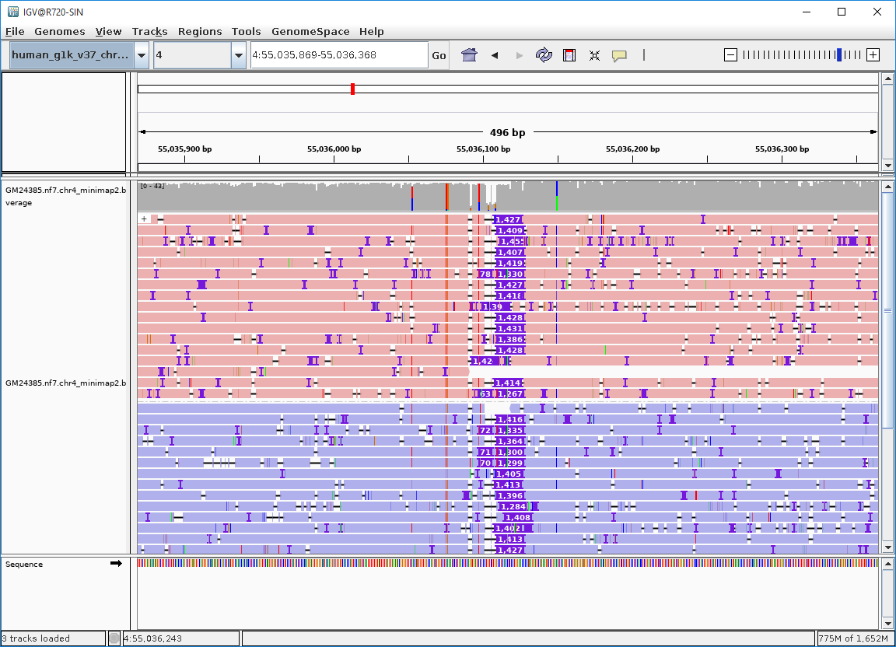
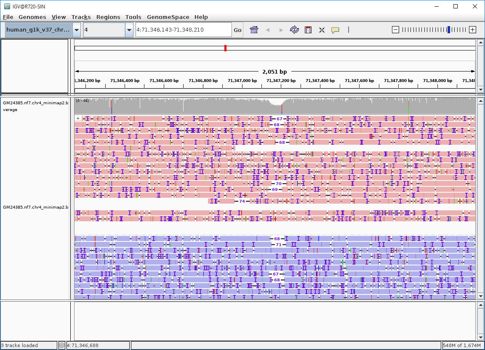
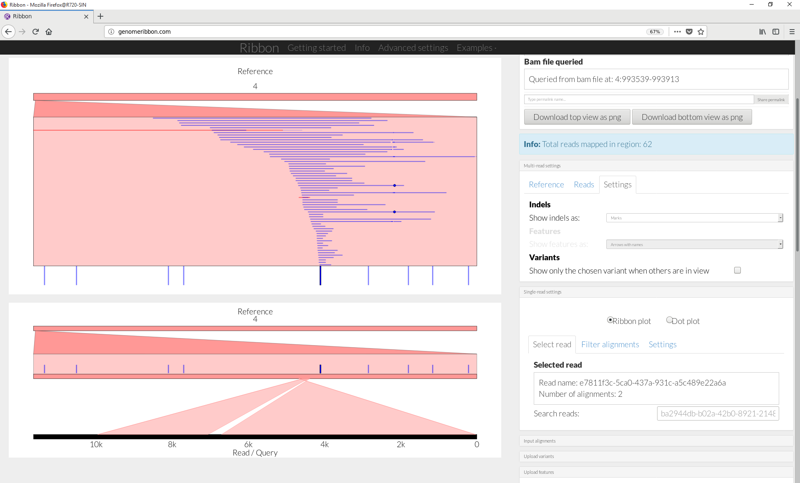

<div style="position:absolute;top:0px;right:0px;padding:15px;background-color:gray;width:45%;">
```{r, echo=FALSE}
knitr::include_graphics("https://nanoporetech.com/themes/custom/nanopore/images/ont-logo.svg?tutorial=sv")
```
</div>


```{r setup, include=FALSE}
knitr::opts_chunk$set(tidy=TRUE, tidy.opts=list(width.cutoff=80), 
                      fig.width=9, fig.height=6, warning=FALSE, message=FALSE, 
                      kable.force.latex=TRUE,
                      highlight=TRUE,
                      cache.path="Analysis/Cache/",
                      knitr.table.format = "html",
                      width = 120,
                      knitr.kable.NA = '')

options(knitr.kable.NA = '')

library(yaml)
library(kableExtra)
library(scales) # required for comma
library(dplyr)
library(nanopoRe) # devtools::install_github("sagrudd/nanopoRe") 
library(emojifont)
library(vcfR)
library(VariantAnnotation)
library(jsonlite)
library(writexl)

config <- yaml.load_file("config.yaml")
#tutorialText   <- config$tutorialText
tutorialText <- TRUE

sample_name <- config$sample_name
input_fastq <- file.path(basename(dirname(config$input_fastq)), basename(config$input_fastq))
reference_fasta <- file.path(basename(dirname(config$reference_fasta)), basename(config$reference_fasta))

### here lie dragons ###
# expeditions below this comment at your own risk
# welcome feedback and suggestions ...

slurpContent <- function(filename) {
  include = as.logical(tutorialText)
  if (include) {
    paste(readLines(filename),collapse="\n")
  }
}

setRpath(file.path("Analysis", "R"))
setReferenceGenome(reference_fasta)
bamFile <- file.path("Analysis", sample_name, "alignment", paste0(sample_name, "_minimap2.bam"))
vcfFile <- file.path("Analysis", sample_name, "sv_calls", paste0(sample_name, "_sniffles_filtered.vcf.gz"))

# load the annotation packages that will be used presently ...
# this is a little ugly; but is is moving the package definitions into config.yaml; will try to install missing
# packages - what could possibly go wrong ...
biocGenome <- config$biocGenome
if (!config$GeneIdMappings %in% installed.packages()[, "Package"]) {BiocManager::install(config$GeneIdMappings)}
library(eval(config$GeneIdMappings), character.only=TRUE)
if (!config$GenomeAnnotation %in% installed.packages()[, "Package"]) {BiocManager::install(config$GenomeAnnotation)}
library(eval(config$GenomeAnnotation), character.only=TRUE)
eval(parse(text=paste0("txdb <- ",config$GenomeAnnotation)))
```


`r slurpContent("Static/TutorialPreamble.md")`


# Study design

The **`ont_tutorial_sv.Rmd`** script was used to generate this report. The configuration file, **`config.yaml`** has been parsed and the fastq format DNA sequence file has been identified as **` `r input_fastq` `**.

```{r fastqSummary, cache=FALSE, echo=FALSE}
if (!file.exists(input_fastq)) {
  cat(paste0("Fatal error - file ["+input_fastq+"] not found\n\n"))
  knitr::knit_exit()
}
validationResponse = fastqCheckup(input_fastq)
if (is.logical(validationResponse)) {
  if (validationResponse==FALSE) {
    cat(paste0("Fatal error - file ["+input_fastq+"] corrupt or not FASTQ format\n\n"))
    knitr::knit_exit()
  }
}

file.data <- t(data.frame(validationResponse[1:5]))

kable(file.data, format="html", caption="Table summarising provided FASTQ file content", booktabs=TRUE, table.envir='table*', linesep="", escape = FALSE, row.names=FALSE)  %>%
  kable_styling(c("striped", "condensed")) %>%
  footnote(symbol=c("Md5 checksum calculated using R digest package"), symbol_title="please note: ", footnote_as_chunk = TRUE)
```


The table above provides an abbreviated summary of the provided fastq format sequence file used by the tutorial. The **checksum** is an *md5sum* checksum that can be used to track the integrity of a specified sequence file - this value should be unique to each DNA sequence file. 


# Mapping Summary

The **`minimap2`** software has been used to map the fastq format sequence reads to the specified reference genome. The results have been collated in a **`BAM`** format mapping file that has been both sorted and indexed. 

The mapping results from the BAM file have been collated and are summarised below. 


```{r mappingExecutiveSummary, echo=FALSE, message=FALSE}
bamSummary <- bamSummarise(bamFile)
primaryBAM <- bamSummary[which(bamSummary$readFlag=="Primary"),]

infographicFile <- infoGraphicPlot4(identifier="mappingSummary", 
                 panelA=c(key="Primary Alignments", value=scales::comma_format()(nrow(primaryBAM)), icon="fa-sliders"), 
                 panelB=c(key="Mapping Yield", value=gdata::humanReadable(sum(primaryBAM$end - primaryBAM$start), standard="SI"), icon="fa-calculator"), 
                 panelC=c(key="Average Accuracy", value=paste0(round(mean(primaryBAM$accuracy)*100,digits=1),"%"), icon="fa-area-chart"), 
                 panelD=c(key="Average Identity", value=paste0(round(mean(primaryBAM$identity)*100,digits=1),"%"), icon="fa-info"))

 knitr::include_graphics(infographicFile)
```

The summary plot above presents key observations from the review of the sequence mapping results. These results highlighted include the number of primary sequence alignments (there will also be other mapping results as either secondary or supplementary mappings that are summarised in a table below), the mapping yield that describes that number of DNA sequence bases that are mapped (primary mapped results only) and the measure of mean accuracy and identity across the primary mapped reads. Accuracy describes the number of correctly mapped sequences bases relative to the reference genome and considers mismatches and INDELs. Identity is similar to accuracy but ignores INDELs. Please note that this is a review of mapping quality - not raw sequence accuracy.


## Assessment of mapping quality and identity

The distributions of mapping accuracy and identity can also be plotted as histograms. The histograms for these distributions is shown below.

```{r mappingIdentity, echo=FALSE, message=FALSE}

p1 <- plotAlignmentAccuracy(bamFile, lower=0.75) 

p2 <- plotAlignmentIdentity(bamFile, lower=0.75)

LeftRightPlot(p1, p2)

```


# Mapping characteristics

The tabulated data and plots above have commented on the overall number of primary mapped sequence reads and have commented on their accuracy and identity. The table below shows additional review of the mapping characteristics where primary, secondary and supplementary mapping reads are considered separately and additional information on the read lengths, read qualities and mapping qualities are presented.


```{r loadMapData, echo=FALSE, warning=FALSE, message=FALSE}

if (!file.exists(bamFile)) {
  cat(paste0("Fatal error - file ["+bamFile+"] not found\n\n"))
  knitr::knit_exit()
}

# load the mapping data
bamSummary <- bamSummarise(bamFile, blockSize=10000)

SVMappingCharacteristicTable(bamSummary, validationResponse, bamFile)
```


The depth and uniformity of sequence coverage across the genome is important for effective SV calling. While the table above provides a mean coverage measure, this does not reveal the amount of variation in coverage across the mapped regions. A histogram showing the distribution of depth-of-coverage across the mapped reference sequence is shown in the figure below. The mean coverage value is highlighted as a vertical red line.
  
```{r mappingAccuracy, echo=FALSE, warning=FALSE, message=FALSE}

nul <- capture.output(covHist <- plotOverallCovHistogram(bamFile))
print(covHist)

```
  

  
  


# Investigation of VCF file produced by Sniffles

The **`Sniffles`** software has been used to identify candidate SVs from the mapping data; the resulting SVs have been filtered by the **`pipeline-structural-variation`** workflow to produce a high-confidence SV dataset. Additional information on this high-confidence subset of SVs is presented in the sections below.

## Structural Variants - Executive Summary


```{r vcfSummary, echo=FALSE, warning=FALSE, message=FALSE}

nul <- capture.output(ins <- Vcf2FilteredGranges(vcfFile, svtype="INS"))
nul <- capture.output(del <- Vcf2FilteredGranges(vcfFile, svtype="DEL"))
nul <- capture.output(dup <- Vcf2FilteredGranges(vcfFile, svtype="DUP"))

infographicFile2 <- infoGraphicPlot3(identifier="SV_types", 
                 panelA=c(key="Insertions",   value=scales::comma_format()(length(ins)), icon="fa-chevron-down"), 
                 panelB=c(key="Deletions",    value=scales::comma_format()(length(del)), icon="fa-cut"), 
                 panelC=c(key="Duplications", value=scales::comma_format()(length(dup)), icon="fa-paperclip"))

 knitr::include_graphics(infographicFile2)
```

The plot above lists the number of insertions, deletions and duplications counted in the high-confidence set of SVs.

```{r SVsummarytable, echo=FALSE}
SVsummary <- NULL
SVsummary <- rbind(SVsummary, c("Insertion", 
                                scales::comma_format()(length(ins)), 
                                round(mean(ins$SVLEN), digits=2), 
                                min(ins$SVLEN), 
                                scales::comma_format()(max(ins$SVLEN))))
SVsummary <- rbind(SVsummary, c("Deletion", 
                                scales::comma_format()(length(del)), 
                                round(mean(del$SVLEN), digits=2), 
                                min(del$SVLEN), 
                                scales::comma_format()(max(del$SVLEN))))
SVsummary <- rbind(SVsummary, c("Duplication", 
                                scales::comma_format()(length(dup)), 
                                round(mean(dup$SVLEN), digits=2), 
                                min(dup$SVLEN), 
                                scales::comma_format()(max(dup$SVLEN))))

kable(SVsummary, format="html", col.names=c("SV type", "Count", "Mean size (nt)", "Shortest (nt)", "Longest (nt)"), caption="Table summarising types of structural variations called", booktabs=TRUE, table.envir='table*', linesep="", escape = FALSE) %>% kable_styling(c("striped", "condensed"))

```

The table above provides some more information on the size distributions of the SVs identified.

```{r svLengthDistribution, echo=FALSE}
nul <- capture.output(svdist <- svLengthDistribution(vcfFile))
print(svdist)
```

The size distribution of different SV types can also be plotted as a histogram. In the figure above, the frequency of different sized SVs is plotted. Please note that the length of the SV has been plotted using a log10 scale.

```{r karyogram, echo=FALSE, warning=FALSE, message=FALSE}

suppressWarnings(nul <- capture.output(karyogram <- snifflesKaryogram(vcfFile)))
print(karyogram)

```

The figure above shows a karyogram shaded with the location of structural variants shaded by insertion, deletion and duplication types. 


# Genomic placement of SVs in annotated genome.

SVs can be seen to be distributed across the reference genome used for the analysis; and do not appear to be clustered around any specific chromosomal location. It is useful to look for the subset of structural variations that overlap with the annotated genes. 


```{r loadVcf, echo=FALSE, message=FALSE, warning=FALSE, results='hide'}
vcf <- readVcf(file=vcfFile, genome=biocGenome)
vcf <- trim(vcf)

seqlevels(vcf) <- paste0("chr",seqlevels(vcf))
seqlevels(vcf, pruning.mode="coarse") <- seqlevels(vcf)[which(seqlevels(vcf) %in% seqlevels(txdb))]

suppressWarnings(variantsGR <- locateVariants(rowRanges(vcf), txdb, AllVariants()))
# filter on some key columns; remove e.g. the TXID and CDSID that lead to duplicates ...
variants <- data.frame(variantsGR)[,c("seqnames", "start", "end", "width", "LOCATION", "QUERYID", "GENEID")]
variants <- variants[!duplicated(variants),]
vcfMeta <- Vcf2GRanges(vcfFile)

genic <- data.frame(variants[which(variants$LOCATION == "coding"),])
genic$SVTYPE <- as.character(vcfMeta[genic$QUERYID,]$SVTYPE)
genic$SVLEN <- as.character(vcfMeta[genic$QUERYID,]$SVLEN)
genic$SYMBOL <- as.character(mapIds(org.Hs.eg.db, keys=genic$GENEID, column="SYMBOL", keytype="ENTREZID"))
genic$start <- as.character(start(vcfMeta[genic$QUERYID,]))
genic$end <- as.character(end(vcfMeta[genic$QUERYID,]))

excelData <- merge(x=as.data.frame(vcfMeta), y=variants, by.x="row.names", by.y="QUERYID")[,c("seqnames.x","start.x","end.x","width.x","SVTYPE","SVLEN","RE","SU","LOCATION", "GENEID")]
excelData$SYMBOL <- as.character(mapIds(org.Hs.eg.db, keys=excelData$GENEID, column="SYMBOL", keytype="ENTREZID"))
excelData$GENEID[which(is.na(excelData$GENEID))] <-  ""
excelData$SYMBOL[which(excelData$SYMBOL=="NULL")] <-  ""
# write excel file of results
write_xlsx(excelData, path = file.path(getRpath(), "sv_genespace_overlap.xlsx"))
```

The complete list of structural variants and their overlaps with annotated genes have been written to an Excel file called **`sv_genespace_overlap.xlsx`**. This is located within the **`R`** folder of the **`Analysis`** results. 

```{r genomeComponentTable, echo=FALSE}
svloctable <- as.data.frame(table(as.character(variants$LOCATION)))

# Var1 is cast as a factor; convert to vector
svloctable$Var1 <- as.character(svloctable$Var1)

svloctable$genes <- lapply(svloctable$Var1, function(x) { length(which(!is.na(unique(variants[which(variants$LOCATION==x),"GENEID"])))) })
svloctable$del <- lapply(svloctable$Var1, function(x) { length(which(mcols(vcfMeta[variants[which(variants$LOCATION==x),"QUERYID"],])$SVTYPE=="DEL")) })
svloctable$ins <- lapply(svloctable$Var1, function(x) { length(which(mcols(vcfMeta[variants[which(variants$LOCATION==x),"QUERYID"],])$SVTYPE=="INS")) })
svloctable$dup <- lapply(svloctable$Var1, function(x) { length(which(mcols(vcfMeta[variants[which(variants$LOCATION==x),"QUERYID"],])$SVTYPE=="DUP")) })

kable(svloctable, format="html", col.names=c("SV location", "Count", "Genes", "Deletions", "Insertions", "Duplications"), caption="Table summarising the genomic location of SVs called", booktabs=TRUE, table.envir='table*', linesep="") %>% kable_styling(c("striped", "condensed"))
```


The **coding** SVs identified in the table above, overlap with annotated gene exons. A deletion, insertion, or duplication event may have functional implications. The table above shows how most SVs are located in the non-protein coding regions of the genome; the majority being within either annotated introns or within the intergenic space. There are however a number of SVs within the the protein-coding space of the genome. The SVs that overlap with the gene exons are summarised in the table below.

```{r codingRegions, echo=FALSE, message=FALSE, warning=FALSE}

genes       <- sort(unique(genic[which(genic$SYMBOL!="NULL"),"SYMBOL"]))
deletions   <- unlist(lapply(genes, function(x) { length(which(genic[which(genic$SYMBOL==x),"SVTYPE"]=="DEL")) }))
insertions  <- unlist(lapply(genes, function(x) { length(which(genic[which(genic$SYMBOL==x),"SVTYPE"]=="INS")) }))
duplications<- unlist(lapply(genes, function(x) { length(which(genic[which(genic$SYMBOL==x),"SVTYPE"]=="DUP")) }))
vsizes      <- unlist(lapply(genes, function(x) { round(mean(as.integer(genic[which(genic$SYMBOL==x),"SVLEN"]))) }))
chromosome  <- unlist(lapply(genes, function(x) { unique(as.character(genic[which(genic$SYMBOL==x),"seqnames"])) }))
start       <- unlist(lapply(genes, function(x) { unique(as.character(genic[which(genic$SYMBOL==x),"start"])) }))
end         <- unlist(lapply(genes, function(x) { unique(as.character(genic[which(genic$SYMBOL==x),"end"])) }))

geneAssociation <- cbind(genes, chromosome, start, end, deletions, insertions, duplications, vsizes)
geneAssociation[geneAssociation=="0"] <- " "


kable(geneAssociation, format="html", col.names=c("GeneId", "Chromosome", "Start", "End", "Deletions", "Insertions", "Duplications", "Mean variant size"), caption="Table listing genes containing SVs, the SV type and SV size", booktabs=TRUE, table.envir='table*', linesep="") %>% kable_styling(c("striped", "condensed"))
```


# Structural Variations and Genomic Repeat Analysis

Much of the vertebrate genome is composed of repeated DNA sequence elements. Different types of SV have been associated with these genomic repeat elements. The table below summarised the overlap of SVs identified with the annotated repeat elements from a **`RepeatMasker`** database of human repeats ([Smit AFA, Hubley R and Green P - RepeatMasker Open-4.0](http://www.repeatmasker.org)). The full corresponding dataset is available as an Excel format spreadsheet file called **`sv_repeats_overlap.xlsx`** in the **`Analysis/R`** results folder.

```{r RepeatMasker, echo=FALSE, message=FALSE, warning=FALSE, results='hide'} 

RepeatGR <- RepeatMaskerGR()
SV <- Vcf2GRanges(vcfFile)
seqlengths(SV) <- getSeqLengths(names(seqlengths(SV)))

overlaps <- findOverlaps(RepeatGR, SV)
suppressWarnings(real <- RepeatGR[queryHits(overlaps)])
realDF <- as.data.frame(table(real$repeatClass))

repeatResults <- realDF[order(realDF$Freq, decreasing=TRUE),][1:15,]

suppressWarnings(
x <- lapply(repeatResults$Var1, function(x) {
  svtargets <- to(findOverlaps(real[which(real$repeatClass == x),], SV, ignore.strand=TRUE))
  repeatSV <- SV[unique(svtargets),]
  return(c(length(unique(svtargets)), 
           length(which(repeatSV$SVTYPE=="DEL")), 
           length(which(repeatSV$SVTYPE=="INS")), 
          length(which(repeatSV$SVTYPE=="DUP"))))
} )
)
repeatResults <- cbind(repeatResults, t(as.data.frame(x)))

xlsx_repeats <- data.frame(cbind(data.frame(real), mcols(SV[subjectHits(overlaps),])[,c("SVTYPE","SVLEN","RE","SU")]))
write_xlsx(xlsx_repeats, path = file.path(getRpath(), "sv_repeats_overlap.xlsx"))
```

```{r repeatAnalysisTable, echo=FALSE}
kable(repeatResults, format="html", col.names=c("Repeat Class", "Frequency", "Unique SV", "Deletions", "Insertions", "Duplications"), caption="Counts of SVs overlapping with annotated Repeatmasker repeats", booktabs=TRUE, table.envir='table*', linesep="", row.names = FALSE) %>% kable_styling(c("striped", "condensed"))
```

The table above describes the number of repeat elements that overlap with annotated SVs. The unique SVs are resolved by type. This table presents count data only and no form of enrichment analysis has been performed to identify the over-represented repeat classes.


# Review of performance against a truthset

This tutorial has used the **`pipeline-structural-variation`** workflow to identify candidate structural variants from the specified dataset. The data included within the tutorial is a subset of sequence data from **`Genome in a Bottle (GIAB)`**. The sequence data used corresponds to whole genome sequence data for individual **`GM002`** - the son from the Ashkenazim trio sequencing study. The GIAB consortium have published a truthset of structural variants for this GM002 individual that have been identified and validated using a variety of DNA sequence analysis methods and have been associated with the parental genomes. The [VCF file for the validated structural variations](https://ftp-trace.ncbi.nlm.nih.gov/giab/ftp/data/AshkenazimTrio/analysis/NIST_SVs_Integration_v0.6/) is available from the GIAB.

Software such as [Truvari](https://github.com/spiralgenetics/truvari/) has been written to enable the comparison of VCF format SV datasets against reference truthsets. The **`Snakefile`** used to perform the structural variation analysis was run with the **`eval`** parameter that has compared the performance of this workflow against the GIAB truthset. This has produced a **`JSON`** file of performance metrics. This is shown in the panel below.


```{r truthset, echo=FALSE}

truvariJson <- fromJSON(file.path("Analysis", sample_name, "evaluation_summary.json"))

infographicFile3 <- infoGraphicPlot3(identifier="truthset_validation", 
                 panelA=c(key="Precision",   value=round(truvariJson$precision, digits=3), icon="fa-dot-circle-o"), 
                 panelB=c(key="Recall",    value=round(truvariJson$recall, digits=3), icon="fa-braille"), 
                 panelC=c(key="F1 score", value=round(truvariJson$f1, digits=3), icon="fa-percent"))

 knitr::include_graphics(infographicFile3)
```

* **`precision`** is the fraction of SVs identified that are correct (a background of false positive SVs will reduce the precision score)
* **`recall`** is the fraction of SVs from the truthset that are correctly identified within the workflow (a background of false negative SVs will reduce the recall score)
* **`F1 score`** is the harmonic mean of the precision and recall and summarises the overall accuracy for the analysis.


# Explore structural variation using IGV


The Integrative Genomics Viewer (**`IGV`**) is a tool (@10.1093/bib/bbs017, @Robinsone31), that has been installed by **`conda`**, for the visualisation of genomics data. The software provides functionality for the display of sequence mapping data from BAM files that can subsequently be overlaid with "tracks" of information that can include depth-of-coverage for mapping data and gene annotations. 



The figure above presents a screenshot from the **`IGV`** software. This has been selected as a 1.5kb insertion from the filtered high-quality SVs. In the centre region of the viewer the insertion event is displayed. The blue and pink shading reveals that reads are mapping to both the forward and reverse strands of the reference DNA - the insertion is observed across all reads and is therefore a probable homozygous insertion.

IGV can also view deletions - the figure below shows what could be a 68 bp heterozygous deletion. There is a reasonable amount of read support for this deletion and the deletion appears to have been sampled from both DNA sequence strands.



**`IGV`** can be started from the command line by using the command `igv`.

We would like to explore the read mapping information around the SV located within the **MUC7** gene. The command below will open the **`IGV`** browser to the appropriate genome coordinates - in this example we are using the feature with coordinates `[Chr 4] Start=71346143, Stop=71348210` - this corresponds to a region 1kb up- and down-stream on the annotated deletion within the **`MUC7`** gene - this should look much the heterozygous deletion figure shown above.


```
igv -g ./ReferenceData/human_g1k_v37_chr4.fasta ./Analysis/GM24385.nf7.chr4/alignment/GM24385.nf7.chr4_minimap2.bam 4:71346143-71348210
```


# Explore structural variation using ribbon

**`Ribbon`** is an interactive structural variation visualisation software that enables the review of mapping characteristics at a per-read resolution rather than the genomic region resolution used by most other genome browsers (@Nattestad082123). **`Ribbon`** has been implemented as a web-application and data analysis is run within your web-browser. To explore the data with **`Ribbon`**, please open the following link and follow the instructions provided by the author. You should provide **`Ribbon`** with the **`BAM`** file of mapping results and your **`VCF`** file of structural variants to get started


[http://genomeribbon.com/](http://genomeribbon.com/)




The image above shows a screenshot from the **`Ribbon`** software presenting the mapping characteristics from reads included in the tutorial dataset. Reads are presented as blue lines within the top panel. One of these reads is highlighted in red and the bottom panel presents the mapping arrangement of this read to the reference genome. This read appears to show a sequence rearrangement that could not be observed with other track-based genome browsers. The structural variants presented in the VCF file are shown a blue vertical ticks in the figure.


# Reproducible research - produce your own report

This report has been created using **`Rmarkdown`** with publicly available **`R`** packages. For clarity the **`R`** packages used, and their versions, are listed below.

\fontsize{8}{12}

```{r sessionInfo, eval=TRUE, echo=FALSE, comment=NA}
utils:::print.sessionInfo(sessionInfo()[-7], locale=FALSE)
```

\fontsize{10}{14}

It is also worth recording the versions of the software that have been used for the analysis.

\fontsize{8}{12}

```{r, engine='bash', echo=FALSE, comment=NA}
conda list "samtools|minimap2|sniffles|snakemake|rstudio"
```

\fontsize{10}{14}

`r slurpContent("Static/TutorialPostamble.md")`

\pagebreak


# References and citations
